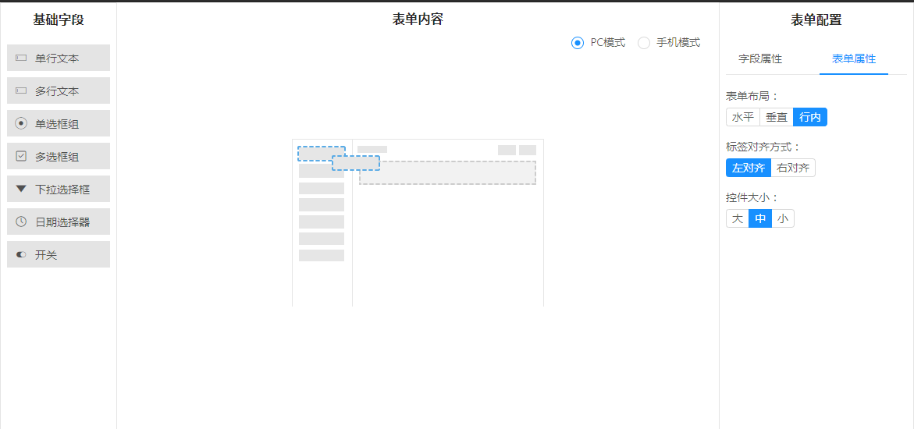
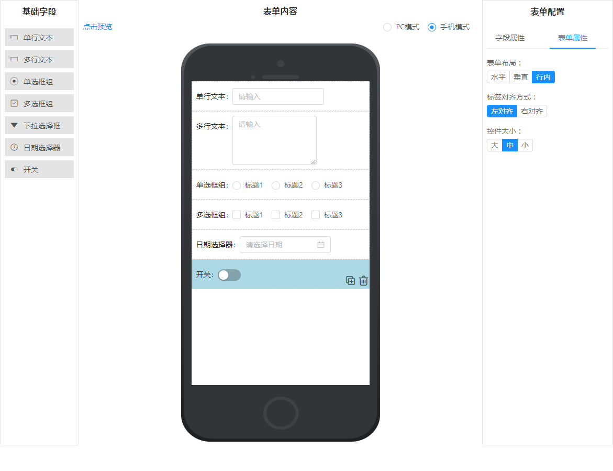
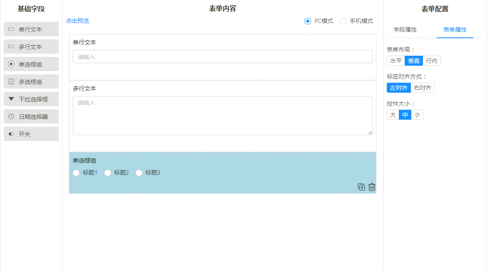
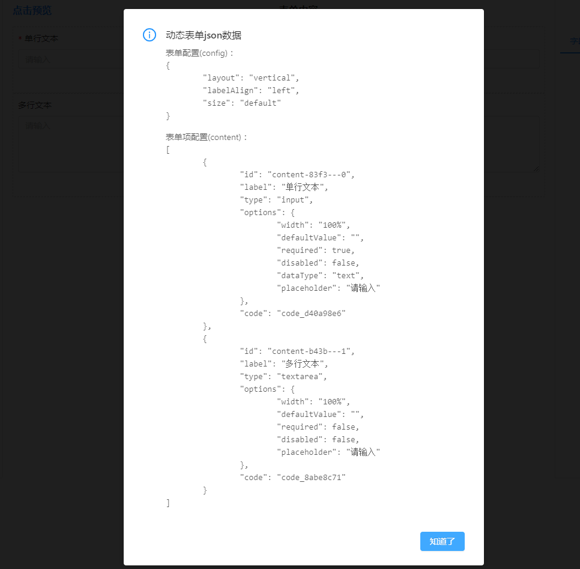

<!--
 * @Author: your name
 * @Date: 2020-06-01 09:22:43
 * @LastEditTime: 2020-06-04 16:12:52
 * @LastEditors: Please set LastEditors
 * @Description: In User Settings Edit
 * @FilePath: \react-form-design\README.md
--> 

## react-form-design
- react-form-design本人基于react、ant-design，react-beautiful-dnd、react-mobx构建开发，实现用拖拉拽和自主配置来实现动态表单设计功能功能，提供一套更优的前端解决方案
- 自主研发，模仿小幺鸡表单设计器（<a target="_blank" href="http://tools.xiaoyaoji.cn/form/#/">点击查看小幺鸡</a>）
- 支持拖拉拽控件，支持二次拖来拽
- 支持自定义配置和布局
- 支持表单验证和表单预览

----------

## Quick Start
#### Install
~~~
npm install
~~~

#### Build
第一次运行或者构建生产环境实体文件时，需要打包build，运行一次。
~~~
npm run build
~~~

#### Run（本地服务器）
~~~
npm run server
~~~

